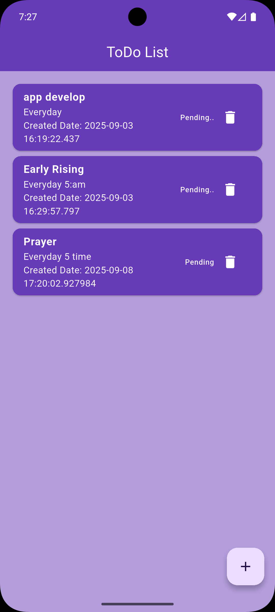
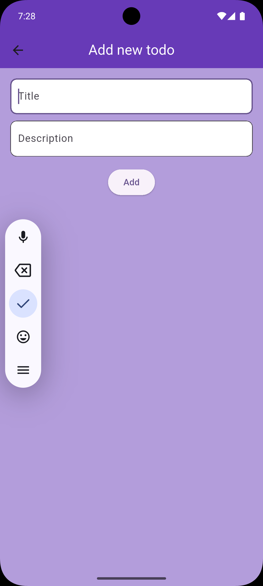

# Flutter Firebase Todo App

A simple **ToDo application** built with **Flutter** and **Firebase Firestore**.  
Users can:
- Add new todos
- View all todos in real-time
- Delete todos

## 🚀 Features
- Flutter + Firebase Firestore integration
- Real-time database updates with StreamBuilder
- Simple UI design with Material Components

## 📂 Project Structure
lib/
 ┣ features/
 ┃ ┗ todos/
 ┃   ┣ screens/
 ┃   ┃ ┣ home_screen.dart
 ┃   ┃ ┗ add_new_todo_screen.dart
 ┃   ┗ widgets/
 ┃     ┗ reuse_card.dart
 ┣ main.dart

## 📸 Screenshots

### 🏠 ToDo List Screen


### ➕ Add New Todo



## 🔧 Setup
1. Clone this repository:
   ```bash
   git clone https://github.com/Tanvir-dev20/todo-app-firebase.git